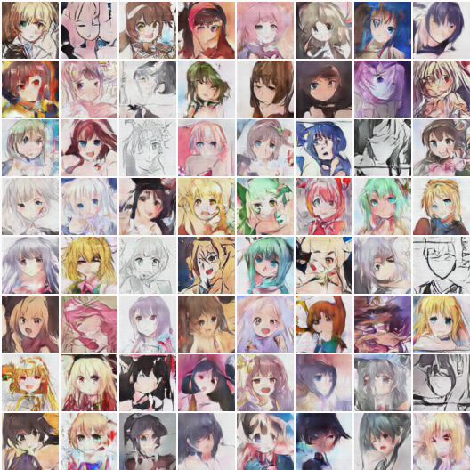
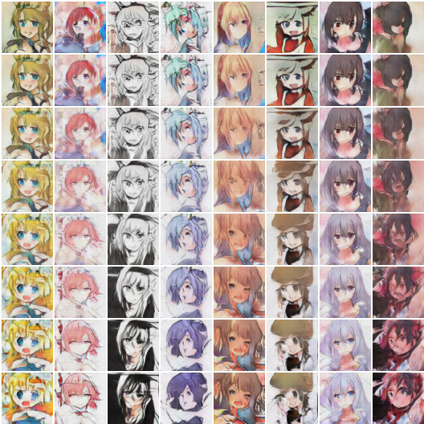
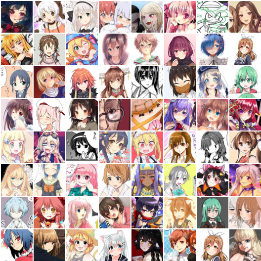

# AnimeGAN

> A simple PyTorch Implementation of  Generative Adversarial Networks, focusing on anime face drawing.


### Randomly Generated Images

The images are generated from a DCGAN model trained on 143,000 anime character faces for 100 epochs.




### Image Interpolation

Manipulating latent codes, enables the transition from images in the first row to the last row.




### Original Images

The images are not clean, some outliers can be observed, which degrades the quality of the generated images.




### Usage

To run the experiment, 

```bash
$ python main.py --dataRoot path_to_dataset/ 
```

The pretrained model for DCGAN are also in this repo, play it inside the jupyter notebook.


### AnimeFace Dataset

Anime-style images  of 126 tags are collected from [danbooru.donmai.us](http://danbooru.donmai.us/) using the crawler tool [gallery-dl](https://github.com/mikf/gallery-dl). The images are then processed by a anime face detector [python-animeface](https://github.com/nya3jp/python-animeface). The resulting dataset contains ~143,000 anime faces. Note that some of the tags may no longer meaningful after cropping, i.e. the cropped face images under 'uniform' tag may not contain visible parts of uniforms.

> How to construct the dataset from scratch ?

  Prequisites: gallery-dl, python-animeface

1. Download anime-style images 

   ```bash
   # download 1000 images under the tag "misaka_mikoto"
   gallery-dl --images 1000 "https://danbooru.donmai.us/posts?tags=misaka_mikoto"

   # In a multi-processing manner
   cat tags.txt | \
   xargs -n 1 -P 12 -I 'tag' \ 
   bash -c ' gallery-dl --images 1000 "https://danbooru.donmai.us/posts?tags=$tag" '
   ```

2. Extract faces from the downloaded images

   ```python
   import animeface
   from PIL import Image

   im = Image.open('images/anime_image_misaka_mikoto.png')
   faces = animeface.detect(im)
   x,y,w,h = faces[0].face.pos
   im = im.crop((x,y,x+w,y+h))
   im.show() # display
   ```


Dig into build_face_dataset.py to find more settings that I used.

> The dataset can also be downloaded from here, https://pan.baidu.com/s/1pLVpgEJ (~400MB), non-commercial use please.

### Things I've learned
1. GANs are really hard to train.
2. DCGAN generally works well, simply add fully-connected layers causes problems.
3. In my cases, more layers for G yields better images, in the sense that G should be more powerful than D.
4. Add noise to D's inputs and labels helps stablize training.
5. Use differnet input and generate resolution (64x64 vs 96x96), there seems no obvious difference during training, the generated images are also very similar.
6. Binray Noise as G's input amazingly works, but the images are not as good as those with Gussian Noise, idea credit to @cwhy ['Binary Noise' here I mean a sequence of {-1,1} generated by bernoulli distribution at p=0.5 ]

I did not carefully verify them, if you are looking for some general GAN tips, see @soumith's [ganhacks](https://github.com/soumith/ganhacks)

### Others

1. This project is heavily influenced by [chainer-DCGAN](https://github.com/mattya/chainer-DCGAN) and [IllustrationGAN](https://github.com/tdrussell/IllustrationGAN), the codes are mostly borrowed from [PyTorch DCGAN example](https://github.com/pytorch/examples/tree/master/dcgan), thanks the authors for the clean codes.
2. Dependencies: pytorch, torchvision
3. This is a toy project for me to learn PyTorch and GANs, most importantly, for fun! :) Any feedback is welcome.

@jayleicn
